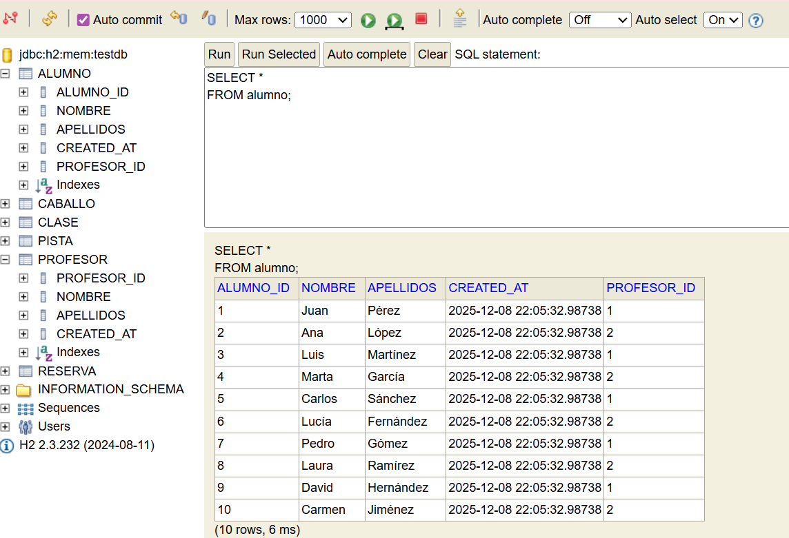

-  Base de datos: 
	  - Se utiliza **H2 en memoria** con **JPA** y **Hibernate** para simular la base de datos durante las pruebas. 
    - Se han utilizado dos ficheros .sql:
      - data.slq para la insercion en las tablas y schema.sql para la creacion de las tablas.

