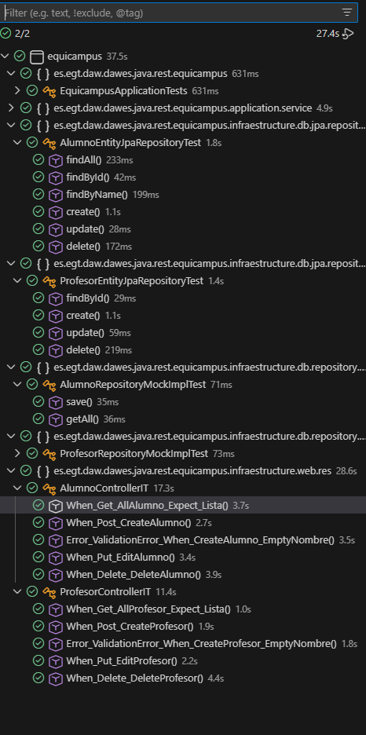

## ⭐ Elementos destacables del desarrollo

### 📦 Versión 1

Durante la primera versión del desarrollo se identificó un problema importante y la forma en que se resolvió fue la siguiente:

- **Desacoplamiento de las pruebas con la base de datos real:**  
  Inicialmente, las pruebas JUnit intentaban acceder a la base de datos H2, aunque se estaban utilizando factorías (*AlumnoFactory*, *ProfesorFactory*) y repositorios mock. Esto provocaba errores en los tests de integración, ya que los datos esperados no coincidían con los presentes en la base de datos.

- **Solución aplicada:**  
  Para resolverlo, se ajustó la configuración de los repositorios mock y se simplificó la prueba del GET, verificando directamente que los endpoints devolvían los datos correctos sin depender de la base de datos H2.

- **Beneficio de la arquitectura Hexagonal:**  
  La separación entre dominio, aplicación e infraestructura permitió aislar los servicios de acceso a datos, facilitando la corrección del problema y permitiendo pruebas más confiables.

- **Uso efectivo de IoC y DI:**  
  La inyección de dependencias de Spring permitió sustituir fácilmente los repositorios reales por implementaciones mock, mejorando la mantenibilidad y la testabilidad del sistema.

---

### 🚀 Versión 2

En la segunda versión se trabajó en la mejora de la capa de presentación utilizando **HTMX** y **Thymeleaf**, encontrando algunos problemas de comunicación entre el frontend y el backend.

- **Problemas con HTMX y Thymeleaf:**  
  Se presentaron errores en la comunicación asíncrona al implementar las operaciones **DELETE** y **EDIT**. Estos errores estaban relacionados con la correcta configuración de las rutas y la respuesta esperada por las peticiones HTMX.

- **Uso de fragmentos de Thymeleaf:**  
  Inicialmente existían dificultades para comprender el funcionamiento de los fragmentos de Thymeleaf.  
  Sin embargo, se logró integrarlos correctamente en los controladores, permitiendo gestionar las vistas desde el backend y mejorando la organización del código.

- **Refactorización de la arquitectura de vistas:**  
  Se dejó de utilizar una lógica de control de vistas desde el frontend para pasar a un control más centralizado desde los controladores, facilitando el mantenimiento y la escalabilidad de la aplicación.