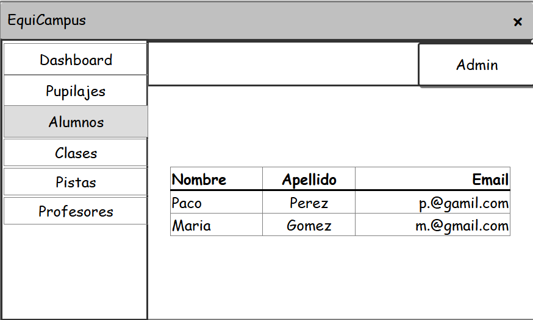

# 🎨 Documentación UX/UI/IxD y Desarrollo Frontend — EquiCampus

## 🏗️ Fases de Construcción Aplicadas al Proyecto

### 1. Definición y Requisitos

En esta fase se definieron las funcionalidades principales de la aplicación EquiCampus:

- Gestión de alumnos  
- Gestión de profesores  
- Autenticación de usuarios  
- Visualización de información mediante tablas dinámicas  
- Generación de documentos PDF  

Para el análisis se utilizaron historias de usuario y análisis de necesidades del sistema.

Ejemplo de historia de usuario aplicada:

> Como administrador, quiero gestionar los alumnos para mantener actualizada la información del sistema.

---

### 2. UX — Experiencia de Usuario y Flujo de Trabajo

El sistema se diseñó pensando en la facilidad de navegación.

La aplicación sigue una estructura web basada en:

Login  
↓  
Dashboard  
↓  
Sidebar navegación  
↓  
Contenido dinámico en el index  

La aplicación utiliza:

- Sidebar lateral estático  
- Topbar superior estático  
- Recarga parcial del contenido principal  

Esto mejora la velocidad de navegación y la experiencia del usuario.



---

### 3. Diseño Gráfico

Para el diseño visual se utilizó:

- Tailwind CSS  
- Diseño responsive  
- Jerarquía visual mediante colores y tamaños  

Se aplicaron las recomendaciones de UX:

- Sistema útil  
- Sistema usable  
- Diseño deseable  
- Sistema accesible  
- Sistema creíble  

---

### 4. Desarrollo e Implementación

Tecnologías utilizadas:

- Spring Boot  
- Thymeleaf  
- HTMX  
- Tailwind CSS  

Durante el desarrollo se realizaron pruebas continuas para verificar:

- Funcionalidad  
- Seguridad  
- Experiencia de usuario  

---

## 👤 Historias de Usuario

### Historia 1
Como administrador, quiero gestionar alumnos para mantener la información actualizada.

### Historia 2
Como usuario, quiero navegar por el sistema de forma rápida para encontrar la información fácilmente.

---

## 🎨 UX / UI / IxD

### UX — Experiencia de Usuario

Se aplicaron principios UX:

- Facilidad de uso  
- Navegación clara  
- Accesibilidad  

Se realizó investigación de usuario para comprender necesidades reales.

---

### UI — Interfaz de Usuario

Se utilizó Tailwind CSS para:

- Estilo consistente  
- Diseño moderno  
- Componentes reutilizables  

Ejemplo de uso:

```html
<div class="p-4 rounded-lg shadow bg-white">
```


## IxD — Diseño de Interacción

El **Interaction Design (IxD)** define cómo el usuario interactúa con la aplicación y cómo el sistema responde a dichas interacciones.

En EquiCampus se diseñaron flujos de interacción intuitivos:

- Click simple para acciones CRUD  
- Formularios dinámicos  
- Actualización parcial de la página  
- Uso de botones con iconografía clara  
  
El objetivo fue reducir el número de pasos necesarios para completar una acción.


Se definieron los siguientes patrones de interacción:

- Confirmaciones antes de eliminar registros  
- Respuestas visuales inmediatas  
- Navegación clara entre módulos  

El diseño de interacción permitió combinar UX y UI para lograr una experiencia coherente.

## ⚡ Implementación de Thymeleaf

Thymeleaf se utiliza como motor de plantillas del lado del servidor.

Permite:

- Renderizar contenido dinámico

- Integración directa con Spring Boot

- Control de vistas desde el backend

Ejemplo de fragmentos:

```html

<aside th:replace="~{fragments/sidebar :: sidebar}"></aside>
    <main class="main-content">
      <header th:replace="~{fragments/topbar :: topbar}"></header>
```

Los fragmentos permiten:

- Reutilización de código

- Separación de componentes

- Mejor mantenimiento

En EquiCampus:

- Sidebar y Topbar son estáticos

- Solo se recarga el contenido del index

## 🔄 HTMX — Interactividad Sin Recargar Página

HTMX se utilizó para mejorar la experiencia del usuario mediante comunicación asíncrona.

Permite:

- CRUD dinámico

- Actualización parcial del DOM

- Reducción de tiempos de carga

Ejemplo:
```html
<button
            hx-get="/web/alumnos/modal-nuevo"
            hx-target="#contenedor-modales"
            hx-swap="innerHTML"
            class="bg-forest text-white px-4 py-2 rounded-lg text-sm font-bold"
          >
            + Nuevo Alumno
          </button>
```

Ventajas:

- Interacciones más rápidas

- Menor carga del servidor

- Mejor UX

## 🎨 Tailwind CSS

Se utilizó Tailwind para:

- Diseño rápido

- Responsividad

- Consistencia visual

Ejemplo:
```html
<div class="flex gap-2 mr-4 hidden sm:flex">
```
## 🧩 Arquitectura de Navegación

La navegación del sistema sigue este esquema:
```markdown
Dashboard
├── Dashboard
├── Pupilajes
├── Pistas
├── Alumnos
└── Profesorado
├── Pagos
└── Configuracion

```` 


## 📱 Prototipado y Diseño

Herramientas utilizadas:

- quicMockUp

- Prototipos HTML

Se recomienda crear prototipos antes del desarrollo para validar:

- Flujo de navegación

- Usabilidad

- Interacción del usuario